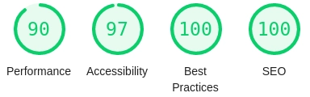

<h1 align="center">
    
</h1>


<h4 align="center"> 
	:heavy_check_mark: MaxDoctor 🚀 Done! :heavy_check_mark:
</h4>
<h1 align="center">
    
</h1>
<p align="center">	
	
  <a href="https://www.linkedin.com/in/pedrocanassa">
    
  </a>


</p>
<p align="center">
</p>
<p align="center">
  <a href="#information_source-whats-next-level-week">MaxDoctor</a>&nbsp;&nbsp;&nbsp;|&nbsp;&nbsp;&nbsp;
  <a href="#rocket-Technologies">Technologies</a>&nbsp;&nbsp;&nbsp;|&nbsp;&nbsp;&nbsp;
  <a href="#information_source-how-to-use">How to use</a>&nbsp;&nbsp;&nbsp;|&nbsp;&nbsp;&nbsp;
  <a href="#memo-license">License</a>
</p>

## :information_source: MaxDoctor?

The web application that consists of a basic record of the CRM and UF. The data will be validated, if correct, the user will be redirected to the base route. See the application [here][doctor] :star_struck:.


## :rocket: Technologies

This project was developed with the following technologies:

- [NextJs][next]
- [React][reactjs]
- [Styled Components][styled]
- [TypeScript][typescript]

## :information_source: How to use

To clone and run this application, you'll need [Git](https://git-scm.com), [Node.js][nodejs] + [Yarn][yarn] installed on your computer.

From your command line:

### Install Front-end

```bash
# Clone this repository
$ git clone https://github.com/canassa13/max-doctor

# Go into the repository
$ cd max-doctor

# Install dependencies
$ yarn install

# Run
$ yarn dev

# running on port 3000
```


## :memo: License	

This project is under the MIT license. See the [LICENSE](https://github.com/canassa13/max-doctor/blob/master/LICENSE) for details.

Made with ♥ by Pedro Canassa :wave: [Get in touch!](https://www.linkedin.com/in/pedrocanassa/)


[nodejs]: https://nodejs.org/
[typescript]: https://www.typescriptlang.org/
[expo]: https://expo.io/
[reactjs]: https://reactjs.org
[yarn]: https://yarnpkg.com/
[next]: https://nextjs.org/
[styled]: https://styled-components.com/
[doctor]: https://max-doctor.vercel.app/
